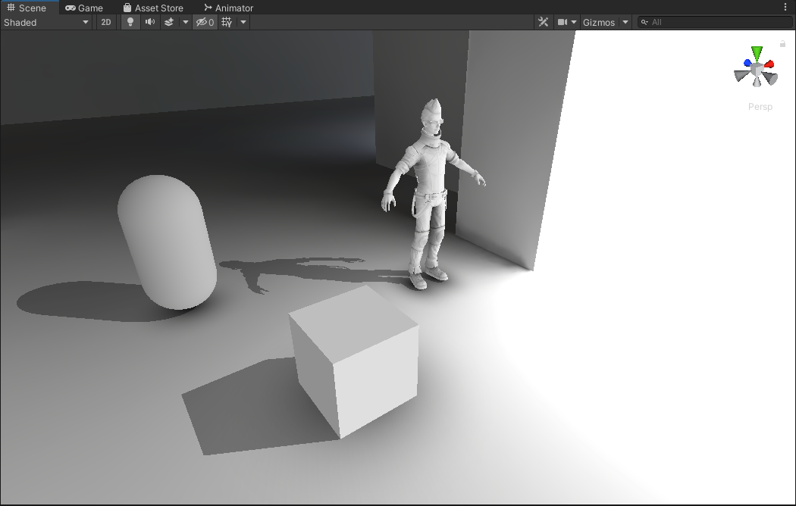
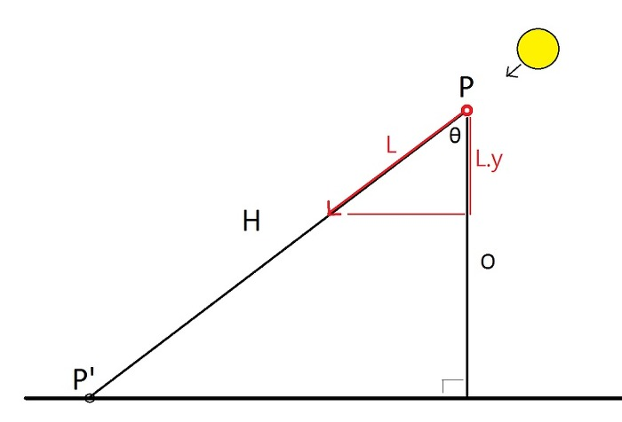

# Unity Planar Shadows

## Results



*Note: In the preview, you can see the planar shadows in action. Blob shadows are also used in conjunction to give the impression of AO. Together they can create very convincing lighting for cheap!*

## How It Works (ORIGINAL)

***Original explanation by [ozlael](https://github.com/ozlael)***

***Detailed explaination (Korean) : http://ozlael.tistory.com/10***

Planar Shadow is an old school technique for cheap shadowing *(Which makes it very useful for mobile games)* Unity’s default shadowing system uses Shadowmaps, however these utilize Pixel Shaders and Render Targets. That means that Shadowmaps can become expensive especially on mobile devices. (This also applies to other engines, not just for Unity).

Planar Shadows are not real shadows, but they look like a shadow because they are flattened out and projected onto a plane according to the direction of light. The vertex shader does the planar projection according to the direction of light, and in the pixel shader is just a single transparent color. *(Which makes it pretty cheap)*.

It uses a little bit of trigonometric math. See image below: 

- **P** is a point of the mesh 
- **P'** is a point of the shadow. 



```
float4 vPosWorld = mul( _Object2World, v.vertex);
float4 lightDirection = -normalize(_WorldSpaceLightPos0); 
float opposite = vPosWorld.y - _PlaneHeight;
float cosTheta = -lightDirection.y;	// = lightDirection dot (0,-1,0)
float hypotenuse = opposite / cosTheta;
float3 vPos = vPosWorld.xyz + ( lightDirection * hypotenuse );
o.pos = mul (UNITY_MATRIX_VP, float4(vPos.x, _PlaneHeight, vPos.z ,1));  
```

### Advantages
1. Cheap! Core part is only for the Vertex Shader. The Pixel Shader handles only color and alpha (plus, Stencil)
2. You can use LOD mesh for shadows. While shadowmaps *(Unity’s shadows)* have to draw original mesh at least twice.
3. Shadows are pixel perfect compared to shadowmaps. Mobile devices have to use blocky hard shadow because they doesn't have enough power to use soft shadows.
4. ***NEW:*** Works with baked lighting. Using light probes, it computes the dominant direction of light.

### Disadvantages
1. **Only works on planar/flat surfaces** *(Does not work on sloped or complex surfaces)*.
2. Only hard shadows.
3. Uses Stencil. But, It is not a big deal nowadays because mobile devices are support it.
4. The shadow will slide around with the baked lighting approach as new dominant sources of light change.

### Future Plans
- Add support for additional lights beyond just the directional light (i.e. spot/point lights).
- Fix layering issue with other duplicate shadow meshes that are casting shadows from realtime lights rather than baked lights.

## Credits

This is based off the work done by **[ozlael](https://github.com/ozlael)** on his [original project](https://github.com/ozlael/PlannarShadowForUnity) so all credit goes to him for the main clever implementation!

As for my contributions... 

- Cleaned up and refactored code for simplicity/clarity. *(only one shader file for each version, planar and blob shadow)*
- [Single-Pass Instancing](https://docs.unity3d.com/Manual/SinglePassInstancing.html) VR support. 
- Support for baked lighting. *(samples the dominant direction of light from light probes)*
- User adjustable value that roughly controls the length of the shadow *(so when the light direction is coming from oblique or grazing angles, you can limit the length of the shadows).*
- Distance Fading with height *(adjustable by the user)*
- Toggle for the planar shadows to stick to an arbitrary plane, or the mesh origin.
- Added blob shadow version, which is similar to the planar shadow implementation except simpler. *(no light directions are accounted for)*
